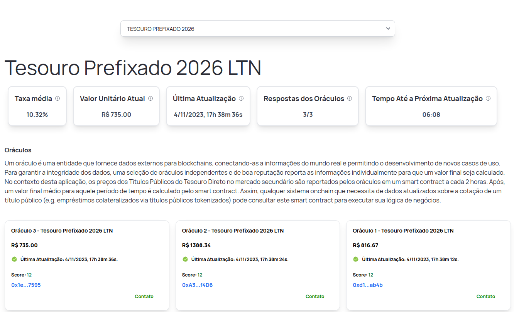

## CoTeD frontend web

This repository contains the web frontend developed for the project CoTeD - Cotação do Tesouro Direto, submitted by the team [Venturus](https://github.com/venturusbr), which won the 2nd place prize at the [Hackathon Web3: Tokenização do Tesouro Nacional](https://web.archive.org/web/20231102034756/https://inova.serpro.gov.br/hackathon-web3-stn/).
The framework used was [Next.js](https://nextjs.org) + [wagmi](https://wagmi.sh) for blockchain connection hooks.

CoTeD is a smart contract based price and rates aggregator similar to [Chainlink](https://chain.link), designed to receive public treasury titles data in the DREX blockchain.

More information, including the smart contracts, at [coted-contracts](https://github.com/izcoser/coted-contracts).

# Uso

`yarn dev`

# Licença

MIT
